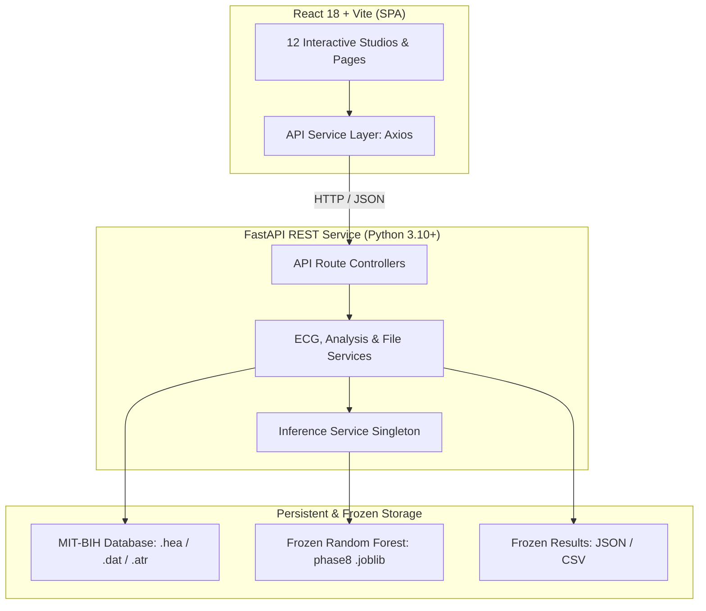

# ECG Signal Processing and Arrhythmia Detection Using Machine Learning

An end-to-end, academic engineering platform integrating classical biomedical digital signal processing, 209-dimensional feature engineering, and a frozen Random Forest classifier to detect cardiac arrhythmias from electrocardiogram (ECG) recordings according to the ANSI/AAMI EC57 standard.

---

## 1. Project Overview

This project provides a full-stack, research-grade engineering application designed for exploring, analyzing, and classifying electrocardiogram signals from the **MIT-BIH Arrhythmia Database**. The system bridges low-level biomedical signal processing with interactive web visualization, enabling beat-by-beat segmentation, 209-dimensional feature extraction, real-time inference, model evaluation against frozen benchmark artifacts, model-level explainability, and systematic error analysis.

> [!IMPORTANT]
> **Academic & Educational Demonstration Only:**
> This project is strictly an academic engineering implementation for research, verification, and educational demonstrations. It is **not** a certified medical diagnostic device, clinical software, or decision-support system. All outputs represent statistical model predictions and must not be used for patient diagnosis or treatment.

---

## 2. Objectives

1. **Rigorous Signal Conditioning**: Implement deterministic baseline wandering removal and amplitude normalization tailored for physiological ECG signals.
2. **Physiologically Grounded Feature Engineering**: Extract high-resolution morphological QRS features coupled with canonical bidirectional heart rate variability (RR) metrics.
3. **Standard-Compliant Classification**: Classify heartbeats into the four major ANSI/AAMI EC57:1998 diagnostic superclasses (**N**, **S**, **V**, **F**) using an inter-record evaluation protocol.
4. **Reproducible Model Provenance**: Lock model hyperparameters and evaluation metrics to ensure total scientific reproducibility on held-out test data.
5. **Interactive Web Telemetry**: Provide a modern, responsive web application for cardiological signal inspection, single-beat feature exploration, model evaluation dashboards, and error analysis.

---

## 3. Key Features

- **Multi-Lead Waveform Studio**: Continuous time-series ECG rendering with interactive decimation, lead switching, and PhysioNet reference annotation overlays.
- **Single Beat Diagnostic Inspector**: High-resolution zoom into individual QRS complexes displaying 200 normalized morphology samples and 9 bidirectional RR interval metrics.
- **Prediction Confidence Studio**: Class posterior probability distributions $[P(N), P(S), P(V), P(F)]$ with decision margin metrics and boundary edge-beat handling.
- **Model Benchmark Dashboard**: Interactive exploration of frozen held-out DS2 performance metrics, ROC-AUC, PR-AUC, and multi-view 4×4 confusion matrices.
- **Explainable AI (XAI) Studio**: Model-level Mean Decrease in Impurity (Gini importance) analysis demonstrating the relative contributions of temporal vs. morphological features.
- **Error Analysis Studio**: Systematic breakdown of the 4,502 classification errors on held-out DS2, highlighting major error transitions ($N \to S$ and $N \to V$).
- **WFDB Upload Pipeline**: Direct ingestion and validation of standard PhysioNet WFDB records (`.hea` + `.dat` + optional `.atr`).
- **Session History & Audit Trail**: Chronological tracking of ingested records and full-record inference sessions.

---

## 4. System Architecture



---

## 5. Dataset

The system is developed on the gold-standard **MIT-BIH Arrhythmia Database** (PhysioNet):
- **Discovered Records**: 48 two-channel ambulatory ECG recordings, sampled at 360 Hz with 11-bit resolution over a 10 mV range.
- **Primary Lead**: Modified Limb Lead II (MLII) used as the primary classification lead where available; Lead V5 utilized as secondary.
- **Evaluation Taxonomy**: ANSI/AAMI EC57:1998 standard four-class mapping:
  - **Class N**: Normal beats, left/right bundle branch blocks, nodal escape beats.
  - **Class S**: Supraventricular ectopic beats (atrial premature, aberrated, nodal premature, SVT).
  - **Class V**: Ventricular ectopic beats (premature ventricular contractions, ventricular escape).
  - **Class F**: Fusion of ventricular and normal beats.
  - *(Class Q / Unclassifiable beats are excluded per EC57 conventions).*
- **Paced Records Policy**: Four records (**102**, **104**, **107**, and **217**) contain pacemaker rhythms. These remain standard MIT-BIH recordings but are excluded from the primary four-class benchmark evaluation in accordance with ANSI/AAMI EC57 recommendations.

---

## 6. Signal Processing Pipeline

The signal conditioning pipeline is designed to eliminate baseline wander and high-frequency noise without distorting critical QRS morphology:

1. **Moving-Average Baseline Removal**:
   - Filter window: $W = 217$ samples ($\approx 602.8\text{ ms}$ at $360\text{ Hz}$).
   - Boundary condition: **Reflection Padding** to eliminate edge distortion.
   - Mechanism: Baseline wander is estimated via rolling moving average and subtracted from the raw lead signal:
     $$\hat{x}_{\text{baseline}}[n] = \frac{1}{W} \sum_{k=-(W-1)/2}^{(W-1)/2} x[n+k]$$
     $$x_{\text{filtered}}[n] = x[n] - \hat{x}_{\text{baseline}}[n]$$
2. **Beat Segmentation**:
   - Extraction of 200 samples around each certified R-peak:
   - Pre-R samples: 90 samples ($[-90, -1]$)
   - R-peak sample: Index 90 (sample offset $0$)
   - Post-R samples: 109 samples ($[+1, +109]$)
3. **Local Per-Beat Z-Score Normalization**:
   - Each segmented 200-sample beat vector is centered and scaled independently:
     $$z[i] = \frac{x_{\text{filtered}}[i] - \mu_{\text{beat}}}{\sigma_{\text{beat}} + \epsilon}$$
   - Ensures robustness against inter-patient amplitude drift and sensor impedance variations.

---

## 7. Feature Engineering

Each heartbeat is characterized by a concatenated **209-dimensional feature vector**:

$$\mathbf{x}_{\text{beat}} = [\mathbf{f}_{\text{morphology}} \,(200\text{-D}) \;\mathbin{\Vert}\; \mathbf{f}_{\text{temporal}} \,(9\text{-D})]$$

### Morphology Features (200 Dimensions)
- Continuous waveform amplitudes $z[0 \dots 199]$ capturing QRS depolarization slopes, R-peak amplitude, and ST-T segment repolarization.

### Canonical Bidirectional RR Features (9 Dimensions)
Temporal coupling features capture short- and medium-term heart rate dynamics:
1. `RR_prev`: Preceding interval in seconds ($t_{k} - t_{k-1}$).
2. `HR_prev`: Preceding instantaneous heart rate ($60.0 / \text{RR}_{\text{prev}}$).
3. `RR_local_median`: Running 10-beat local median RR interval.
4. `RR_ratio_prev`: Preceding coupling ratio ($\text{RR}_{\text{prev}} / \text{RR}_{\text{local\_median}}$).
5. `RR_dev_prev`: Preceding deviation ($\text{RR}_{\text{prev}} - \text{RR}_{\text{local\_median}}$).
6. `RR_next`: Subsequent interval in seconds ($t_{k+1} - t_{k}$).
7. `HR_next`: Subsequent instantaneous heart rate ($60.0 / \text{RR}_{\text{next}}$).
8. `RR_ratio_bidi`: Bidirectional ratio ($\text{RR}_{\text{prev}} / \text{RR}_{\text{next}}$).
9. `RR_bidi_diff`: Bidirectional interval difference ($\text{RR}_{\text{next}} - \text{RR}_{\text{prev}}$).

### Edge Beat Handling
The first beat ($k=0$) and last beat ($k=N-1$) of any recording lack complete bidirectional intervals. These are treated as **unclassified edge beats** (`predicted_class = null`, `confidence = 0.0`, posterior probabilities set to zero) and are excluded from model classification.

---

## 8. Machine Learning Model

The production classifier is a **Random Forest Classifier** locked from Phase 8:

| Parameter | Frozen Value | Architectural Rationale |
|---|---|---|
| **Model Family** | `RandomForestClassifier` | Ensemble of decorrelated decision trees |
| **Number of Trees** (`n_estimators`) | 200 | Minimizes variance without overfitting |
| **Maximum Depth** (`max_depth`) | 30 | Deep trees to capture complex morphology-RR interactions |
| **Min Samples to Split** (`min_samples_split`) | 5 | Regularization against leaf noise |
| **Min Samples per Leaf** (`min_samples_leaf`) | 2 | Smooths probability calibration |
| **Max Features** (`max_features`) | `'sqrt'` ($\approx \sqrt{209} \approx 14$) | Decorrelates individual decision trees |
| **Class Weighting** (`class_weight`) | `'balanced'` | Offsets severe majority-class imbalance (N vs S/V/F) |
| **Random State** (`random_state`) | 42 | Ensures deterministic model reproducibility |
| **Target Classes** | `['N', 'S', 'V', 'F']` | Canonical ANSI/AAMI EC57 superclasses |

---

## 9. Evaluation Methodology

The model was trained and evaluated following the established **inter-record split** paradigm (Chazal et al., 2004) to prevent data leakage between beats from the same subject:

- **DS1 Training Cohort (16 records)**: 101, 106, 109, 112, 115, 116, 119, 122, 124, 203, 205, 207, 208, 215, 223, 230 (38,029 beats).
- **DS1 Validation Cohort (6 records)**: 108, 114, 118, 201, 209, 220 (12,918 beats).
- **DS2 Held-Out Test Cohort (22 records)**: 100, 103, 105, 111, 113, 117, 121, 123, 200, 202, 210, 212, 213, 214, 219, 221, 222, 228, 231, 232, 233, 234 (**49,639 usable beats**).

---

## 10. Frozen DS2 Results

All reported results reflect the frozen evaluation conducted on the **49,639 usable beats** of the held-out DS2 test set:

### Overall Benchmark Metrics
- **Overall Accuracy**: **90.93%** ($45,137 / 49,639$)
- **Balanced Accuracy**: **70.00%**
- **Macro Precision**: **63.48%**
- **Macro Recall**: **70.00%**
- **Macro F1-Score**: **0.6403**
- **Weighted F1-Score**: **0.9174**
- **ROC-AUC (Macro OVR)**: **0.9425**
- **PR-AUC (Macro OVR)**: **0.6280**

### Per-Class Performance
| Class | Precision | Recall | F1-Score | Support (Beats) |
|---|---|---|---|---|
| **N (Normal)** | 97.71% | 92.42% | 0.9499 | 44,197 |
| **S (Supraventricular)** | 38.45% | 75.64% | 0.5098 | 1,835 |
| **V (Ventricular)** | 69.75% | 87.20% | 0.7750 | 3,220 |
| **F (Fusion)** | 48.00% | 24.74% | 0.3265 | 388 |

---

## 11. Confusion Matrix Documentation

The frozen 4×4 contingency matrix on the 49,639 beats of held-out DS2:

| True \ Predicted | Predicted N | Predicted S | Predicted V | Predicted F | Total Support |
|---|---|---|---|---|---|
| **True N** | **40,845** | 2,154 | 1,126 | 72 | 44,197 |
| **True S** | 382 | **1,388** | 58 | 7 | 1,835 |
| **True V** | 334 | 52 | **2,808** | 26 | 3,220 |
| **True F** | 242 | 16 | 34 | **96** | 388 |
| **Total Predicted** | 41,803 | 3,610 | 4,026 | 201 | **49,639** |

---

## 12. Feature Importance Documentation

Feature importance was computed using Random Forest **Mean Decrease in Impurity (Gini Importance)**. The 9 temporal RR features collectively account for **26.38%** of the model's total predictive decision weight.

### Top-15 Feature Rankings
1. `RR_ratio_prev` (0.0582) — Preceding coupling ratio
2. `RR_ratio_bidi` (0.0491) — Bidirectional interval ratio
3. `ECG_092` (0.0324) — Morphology sample +2 post-R peak
4. `ECG_091` (0.0298) — Morphology sample +1 post-R peak
5. `RR_prev` (0.0285) — Preceding interval duration
6. `ECG_093` (0.0276) — Morphology sample +3 post-R peak
7. `RR_dev_prev` (0.0265) — Preceding local median deviation
8. `ECG_090` (0.0245) — R-peak center point
9. `RR_next` (0.0231) — Subsequent interval duration
10. `ECG_094` (0.0218) — Morphology sample +4 post-R peak
11. `ECG_089` (0.0205) — Morphology sample -1 pre-R peak
12. `HR_prev` (0.0198) — Preceding instantaneous heart rate
13. `RR_bidi_diff` (0.0184) — Subsequent vs. preceding interval difference
14. `RR_local_median` (0.0162) — Running 10-beat median interval
15. `ECG_095` (0.0154) — Morphology sample +5 post-R peak

*(Notice: Gini importance reflects tree split impurity reduction and does not denote causal biological relationships or patient-specific attribution).*

---

## 13. Error Analysis Documentation

Across the held-out DS2 test cohort, the model committed **4,502 total beat misclassifications** (an observed error rate of 9.07%):

### Primary Error Transitions
1. **$N \to S$ (2,154 errors, 47.85% of all errors)**: Normal beats misclassified as supraventricular ectopic due to minor sinus arrhythmia or respiratory sinus variations.
2. **$N \to V$ (1,126 errors, 25.01% of all errors)**: Normal beats misclassified as ventricular ectopic due to motion artifacts, baseline drift, or conduction delays mimicking PVCs.
3. **$S \to N$ (382 errors, 8.48% of all errors)**: Subtly premature supraventricular beats missed due to compensatory pauses.
4. **$V \to N$ (334 errors, 7.42% of all errors)**: Ventricular ectopic beats exhibiting narrow QRS morphology misclassified as normal.
5. **$F \to N$ (242 errors, 5.38% of all errors)**: Fusion beats misclassified as normal due to predominance of sinus conduction.

The top two transitions ($N \to S$ and $N \to V$) constitute **72.86%** of all errors.

---

## 14. Web Application Features

The frontend provides 12 integrated research and visualization studios:

1. **Dashboard** (`/`): High-level system overview, server health status, key dataset metrics, and quick-start workflow actions.
2. **Record Explorer** (`/records`): Comprehensive catalog of MIT-BIH recordings with search, duration, sampling frequency, and partition tags (DS1 Train, DS1 Val, DS2 Test).
3. **Interactive Waveform Studio** (`/waveform/:recordId`): High-performance time-series ECG browser supporting multi-lead navigation, window panning, zoom levels, and PhysioNet annotation markers.
4. **Full Record Analysis Studio** (`/analysis/:recordId`): End-to-end beat segmentation and batch inference pipeline reporting overall class breakdowns, detection percentages, and paginated beat tables.
5. **Beat Inspector** (`/beat/:recordId/:beatIndex`): Deep inspection of individual beats displaying the 200-sample normalized waveform alongside the 9 RR temporal features.
6. **Prediction Confidence Studio** (`/prediction/:recordId/:beatIndex`): Interactive probability distribution graphs $[P(N), P(S), P(V), P(F)]$, decision margins, and ground-truth agreement indicators.
7. **Model Evaluation Studio** (`/benchmark`): Complete exploration of frozen DS2 benchmark results, class-wise precision/recall, and interactive 4×4 confusion matrix views (counts, recall %, precision %).
8. **Explainable AI (XAI) Studio** (`/interpretability`): Visualizations of the top-15 Gini feature rankings, morphology vs. temporal importance breakdowns, and methodological documentation.
9. **Error Analysis Studio** (`/error-analysis`): Systematic analysis of the 4,502 DS2 classification errors, transition chord graphs, and per-record error distributions.
10. **WFDB Upload Studio** (`/upload`): Ingestion interface for user-uploaded WFDB files (`.hea`, `.dat`, optional `.atr`) with header format verification.
11. **Session History** (`/history`): Audit trail of uploaded records and full-record inference sessions.
12. **Methodology & About** (`/about`): In-depth documentation of the ANSI/AAMI EC57 taxonomy, feature extraction algorithms, and academic references.

---

## 15. Technology Stack

- **Frontend**:
  - React 18 (Component architecture, custom hooks)
  - Vite 5 (Fast build tooling and local development proxy)
  - React Router DOM 6 (Client-side route orchestration)
  - Recharts 2 (Hardware-accelerated SVG time-series and bar charts)
  - Axios (Centralized API service communication)
- **Backend**:
  - Python 3.10+
  - FastAPI (High-performance async REST framework)
  - Pydantic v2 (Strict request and response schema validation)
  - Uvicorn (ASGI production server)
- **Signal Processing & Machine Learning**:
  - WFDB Python Library (Official PhysioNet waveform reader)
  - NumPy & SciPy (Array operations, moving-average filtering, signal reflection)
  - Scikit-Learn (Random Forest implementation, evaluation metrics)
  - Joblib (Model artifact serialization)

---

## 16. Project Structure

```
ECG-ARRHYTHMIA-ANALYSIS/
│
├── backend/
│   ├── app/
│   │   ├── api/
│   │   │   └── routes/          # FastAPI endpoints (ecg, analysis, experiments, etc.)
│   │   ├── core/                # App config, custom errors, logging setup
│   │   ├── ml/                  # Model definitions and persistence verification
│   │   ├── models/              # Pydantic schemas (requests & responses)
│   │   ├── services/            # Core business logic (ECG, feature, inference, experiment)
│   │   └── utils/               # Signal validators and math helpers
│   │
│   ├── data/
│   │   ├── mitbih/              # MIT-BIH PhysioNet records (.hea, .dat, .atr)
│   │   ├── processed/           # Split manifests and metadata
│   │   │   └── ml_results/      # Frozen Phase 8 benchmark artifacts (JSON & CSV)
│   │   └── uploads/             # User-uploaded WFDB files
│   │
│   ├── models/
│   │   └── phase8/              # Frozen Random Forest model artifact (.joblib)
│   │
│   ├── tests/                   # Automated pytest suite (smoke, inference, features)
│   ├── requirements.txt         # Pinned Python dependencies
│   ├── .env.example             # Backend environment template
│   └── README.md                # Backend technical guide
│
├── frontend/
│   ├── src/
│   │   ├── components/          # Reusable UI & ECG visualization components
│   │   ├── hooks/               # Custom React hooks (useECG, useBenchmark, etc.)
│   │   ├── pages/               # 12 primary page view studios
│   │   ├── services/            # Centralized API service layer (api.js)
│   │   └── utils/               # Color mappings and taxonomy constants
│   │
│   ├── package.json             # Pinned Node dependencies & npm scripts
│   ├── vite.config.js           # Vite dev server and proxy config
│   ├── .env.example             # Frontend environment template
│   └── README.md                # Frontend technical guide
│
├── scripts/                     # Operational utility scripts
├── .gitignore                   # Version control exclusion rules
└── README.md                    # Root project documentation (this document)
```

---

## 17. Installation & Setup

### Prerequisites
- **Python**: Version 3.10, 3.11, or 3.12
- **Node.js**: Version 18.x or 20.x LTS
- **Git**: Installed and configured

---

### Backend Setup (Windows PowerShell)

1. Open PowerShell and navigate to the `backend/` directory:
   ```powershell
   cd backend
   ```
2. Create and activate a Python virtual environment:
   ```powershell
   python -m venv .venv
   .\.venv\Scripts\Activate.ps1
   ```
3. Install backend dependencies:
   ```powershell
   pip install -r requirements.txt
   ```
4. Configure environment settings:
   ```powershell
   Copy-Item .env.example .env
   ```
5. Verify model artifact:
   Ensure `backend/models/phase8/random_forest_final_phase8.joblib` is present.
6. Start the FastAPI server:
   ```powershell
   uvicorn app.main:app --reload --port 8000
   ```
   *The backend will be available at `http://127.0.0.1:8000`. Interactive OpenAPI documentation is hosted at `http://127.0.0.1:8000/docs`.*

---

### Frontend Setup (Windows PowerShell)

1. Open a second PowerShell terminal and navigate to the `frontend/` directory:
   ```powershell
   cd frontend
   ```
2. Install frontend dependencies:
   ```powershell
   npm install
   ```
3. Start the Vite development server:
   ```powershell
   npm run dev
   ```
   *The web application will launch at `http://localhost:5173`. Vite automatically proxies API requests to `http://127.0.0.1:8000`.*

---

## 18. API Overview

| Method | Endpoint | Description |
|---|---|---|
| `GET` | `/api/health` | Health probe reporting service status and model availability |
| `GET` | `/api/ecg/records` | Discover all available MIT-BIH recordings |
| `GET` | `/api/ecg/{record_id}/metadata` | Retrieve duration, sampling rate, channels, and lead metadata |
| `GET` | `/api/ecg/{record_id}/signal` | Fetch downsampled continuous ECG waveform telemetry |
| `GET` | `/api/ecg/{record_id}/annotations` | Retrieve PhysioNet certified reference beat annotations |
| `POST` | `/api/analysis/{record_id}` | Trigger full-record segmentation, feature extraction, and inference |
| `GET` | `/api/analysis/{record_id}/summary` | Retrieve cached lightweight record analysis summary |
| `GET` | `/api/analysis/{record_id}/beats` | Paginated beat list with predicted labels, ground truth, and status |
| `GET` | `/api/analysis/{record_id}/beats/{beat_idx}` | Retrieve single beat detail (200 morphology samples + 9 RR features) |
| `GET` | `/api/model/info` | Frozen model provenance, hyperparameters, and partition specs |
| `GET` | `/api/experiments/benchmark` | Locked Phase 8 DS2 benchmark metrics and 4×4 confusion matrix |
| `GET` | `/api/experiments/generalization` | Inter-record evaluation comparison (DS1 validation vs. DS2 test) |
| `GET` | `/api/experiments/feature-importance` | Model-level Gini feature importances and temporal total |
| `GET` | `/api/experiments/record-breakdown` | DS2 held-out evaluation breakdown across individual patient records |
| `GET` | `/api/experiments/dataset-distribution` | ANSI/AAMI cohort beat distributions across DS1, DS2, and paced groups |
| `GET` | `/api/experiments/artifacts` | Safe metadata regarding available experiment artifact files |
| `GET` | `/api/history` | Chronological session history and upload audit trail |
| `POST` | `/api/upload` | Ingest user-uploaded WFDB records (`.hea` + `.dat` + optional `.atr`) |

---

## 19. Upload Format

The application accepts standard **PhysioNet WFDB format** archives:
- **Required Header (`.hea`)**: ASCII text file defining record leads, sampling rate, baseline, and ADC units.
- **Required Signal (`.dat`)**: Binary 16-bit or 212 format ECG time-series signal.
- **Optional Annotation (`.atr`)**: Binary WFDB reference annotation file.
- **File Naming**: All files uploaded together must share the exact same base record name (e.g., `sample1.hea`, `sample1.dat`, `sample1.atr`).
- Arbitrary PDF or CSV uploads are rejected with descriptive validation feedback.

---

## 20. Limitations

1. **Intra-Dataset Evaluation**: The evaluation is conducted entirely within the MIT-BIH Arrhythmia Database. While the DS1/DS2 inter-record split prevents subject overlap, the model has not been evaluated across external cohorts (e.g., INCART, AHA, or PTB-XL).
2. **Class Imbalance Impact**: Due to the biological scarcity of Supraventricular (S) and Fusion (F) beats in outpatient ambulatory recordings, precision on Class S (38.45%) and recall on Class F (24.74%) remain lower than majority classes.
3. **No Clinical Generalization**: The model has not undergone clinical validation, medical device certification, or clinical trials.
4. **Boundary Beat Exclusion**: The first and last beats of any recording are excluded from classification due to undefined RR timing boundaries.
5. **Client-Side Rendering Thresholds**: Continuous ECG waveform streaming is downsampled to a maximum of 50,000 points per request to preserve browser rendering performance.

---

## 21. Academic Disclaimer

```
================================================================================
                              ACADEMIC DISCLAIMER
================================================================================
This project is an academic engineering application for ECG signal processing
and machine-learning analysis. Model outputs are intended strictly for research
and educational demonstration and are NOT medical diagnoses, clinical opinions,
or a substitute for professional clinical judgment.

The developers and contributors accept no liability for any medical decisions,
diagnoses, or patient care actions taken based on the information or predictions
provided by this software.
================================================================================
```

---

## 22. Future Improvements

- **Cross-Database External Validation**: Evaluation on large-scale multi-lead databases such as PTB-XL, INCART, or CPSC 2018.
- **Deep Sequence Architectures**: Benchmarking against Temporal Convolutional Networks (TCN) or Bidirectional LSTMs.
- **Automated QRS R-Peak Detection**: Integrating automated Pan-Tompkins or Hamilton QRS detectors for completely unannotated raw signals.
- **Local Beat Explainability**: Integration of real-time perturbation-based saliency mapping for individual QRS complexes.
- **Deployment Containerization**: Multi-stage Docker containerization and Kubernetes deployment manifests.

---

## 23. Dataset Attribution & License

- **Dataset**: MIT-BIH Arrhythmia Database.
- **Attribution**:
  - Moody GB, Mark RG. *The impact of the MIT-BIH Arrhythmia Database.* IEEE Eng in Med and Biol 20(3):45-50 (May-June 2001).
  - Goldberger AL, Amaral LAN, Glass L, Hausdorff JM, Ivanov PCh, Mark RG, Mietus JE, Moody GB, Peng C-K, Stanley HE. *PhysioBank, PhysioToolkit, and PhysioNet: Components of a New Research Resource for Complex Physiologic Signals.* Circulation 101(23):e215-e220 (2000).
- **Terms**: Access and usage adhere to the official PhysioNet / Open Data Commons Attribution License.
